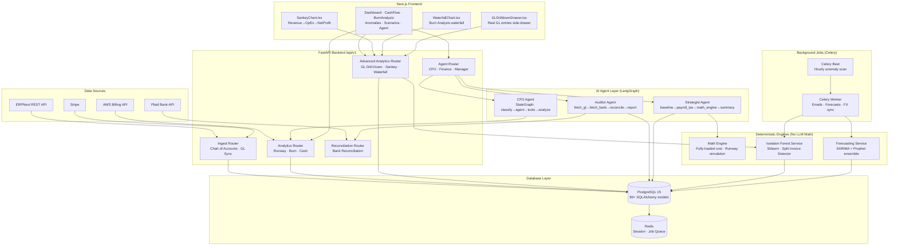

# Vireon Autonomous AI CFO — Architecture

## System Architecture Diagram (Mermaid)

---

## New Components Added (April 2026 Upgrade — v3.0)

### Backend — Phase 2

| File | Purpose |
|------|---------|
| `services/isolation_forest_service.py` | Sklearn Isolation Forest anomaly detector — split invoices, seasonal patterns |
| `services/math_engine.py` | Deterministic scenario simulator — fully-loaded headcount costs, runway projection |
| `agent/auditor_agent.py` | LangGraph Auditor Agent — autonomous bank reconciliation |
| `agent/strategist_agent.py` | LangGraph Strategist Agent — complex scenario planning |
| `api/routers/advanced_analytics.py` | GL drill-down, Sankey data, Waterfall data, IF scan, agent endpoints |

### Backend — Phase 3 & 4

| File | Purpose |
|------|---------|
| `services/accrual_detection_service.py` | Missing expense accruals, deferred revenue recognition, payroll period-end estimates |
| `services/predictive_tax_service.py` | Multi-jurisdiction corporate tax, payroll tax, R&D credits, deduction optimizer |
| `services/dso_forecast_service.py` | Prophet-based DSO forecasting → cash collection projection |
| `services/cfar_service.py` | Cash Flow at Risk — 10,000 Monte Carlo paths, VaR-style fan chart |
| `services/vendor_risk_service.py` | Vendor risk intelligence + zero-shot tax code classifier |
| `agent/close_agent.py` | Agentic month-end close workflow (LangGraph + direct fallback) |
| `api/routers/phase3.py` | All Phase 3/4 API endpoints (10 routes) |
| `api/routers/stripe_webhooks.py` | Real-time Stripe webhook handler with HMAC-SHA256 verification |

### New API Endpoints

| Method | Path | Description |
|--------|------|-------------|
| `POST` | `/api/v1/advanced/anomalies/isolation-forest` | Run ML anomaly scan |
| `GET`  | `/api/v1/advanced/gl/drilldown` | GL entries for a category (powers drawer) |
| `POST` | `/api/v1/advanced/agents/reconcile` | Trigger Auditor Agent |
| `POST` | `/api/v1/advanced/agents/scenario` | Trigger Strategist Agent |
| `GET`  | `/api/v1/advanced/cash-flow/sankey` | Sankey diagram data |
| `GET`  | `/api/v1/advanced/burn-analysis/waterfall` | Waterfall chart data |
| `POST` | `/api/v1/agent/auditor/reconcile` | Auditor via agent router |
| `POST` | `/api/v1/agent/strategist/scenario` | Strategist via agent router |

### Frontend

| File | Purpose |
|------|---------|
| `components/SankeyChart.tsx` | Pure-SVG Cash Flow Sankey — Revenue→OpEx→NetProfit. Clickable nodes. |
| `components/WaterfallChart.tsx` | Recharts Waterfall — month-over-month burn analysis. Clickable bars. |
| `components/GLDrilldownDrawer.tsx` | Slide-out drawer showing real GL entries for any clicked category |
| `app/(dashboard)/cash-flow/page.tsx` | Upgraded with Sankey + GL drill-down |
| `app/(dashboard)/burn-analysis/page.tsx` | New page — Waterfall chart + KPIs + GL drill-down |

---

## Feature Roadmap: Stable → Sophisticated Enterprise

### Phase 1 — Complete ✅ (Current)
- Multi-dashboard financial analytics (CEO, CTO, Finance)
- LangGraph CFO Agent with 100+ tools
- SARIMA + Prophet forecasting
- ERPNext + Plaid integration
- Email alerts & anomaly detection
- Docker orchestration

### Phase 2 — Done in this upgrade ✅
- **Isolation Forest v2** — ML anomaly detection replacing static thresholds
- **Deterministic Math Engine** — all financial simulations are arithmetic-only (no LLM hallucinations)
- **Auditor Agent** — autonomous bank reconciliation with LangGraph
- **Strategist Agent** — scenario planning: "hire 5 engineers in Dubai + lose biggest client"
- **Sankey Cash Flow Map** — interactive Revenue→OpEx→Net flow diagram
- **Waterfall Burn Analysis** — month-over-month cash change visualization
- **GL Drill-Down** — click any chart segment to see real General Ledger entries

### Phase 3 — Enterprise Tier ✅ COMPLETE
- **Automatic Accrual Detection** ✅ — `services/accrual_detection_service.py` + `POST /api/v1/phase3/accruals/detect`
- **Predictive Tax Provisioning** ✅ — `services/predictive_tax_service.py` + `POST /api/v1/phase3/tax/provision`
- **Prophet DSO Forecasting** ✅ — `services/dso_forecast_service.py` + `POST /api/v1/phase3/dso/forecast`
- **Automated Month-End Close** ✅ — `agent/close_agent.py` + `POST /api/v1/phase3/close/run`
- **Multi-Entity Consolidation UI** ✅ — `app/(dashboard)/consolidation/page.tsx`
- **Real-Time Stripe Webhooks** ✅ — `api/routers/stripe_webhooks.py` + `POST /api/v1/webhooks/stripe/events`
- **SOC 2 Audit Trail** ✅ — `services/audit_service.py` (existing, SHA-256 hashed immutable events)
- **Board Deck Auto-Generator** ✅ — `api/routers/board_reports.py` (existing)

### Phase 4 — Research-Backed Additions ✅ COMPLETE
- **Agentic Close Workflow** ✅ — LangGraph CloseAgent in `agent/close_agent.py` (graceful fallback to direct orchestration)
- **Zero-Shot Tax Code Classification** ✅ — `services/vendor_risk_service.py` + `POST /api/v1/phase3/tax/classify`
- **Cash Flow at Risk (CFaR)** ✅ — `services/cfar_service.py` (10,000 Monte Carlo paths) + `POST /api/v1/phase3/cfar/simulate`
- **Vendor Risk Intelligence** ✅ — `services/vendor_risk_service.py` + `POST /api/v1/phase3/vendor-risk/analyze`
- **NLP Contract Risk Extraction** ✅ — `POST /api/v1/phase3/contracts/risk-extract` (8 risk clause detectors)

### Phase 3/4 New API Endpoints

| Method | Path | Description |
|--------|------|-------------|
| `POST` | `/api/v1/phase3/accruals/detect` | Auto accrual detection |
| `POST` | `/api/v1/phase3/tax/provision` | Predictive tax provisioning |
| `POST` | `/api/v1/phase3/dso/forecast` | Prophet DSO cash flow forecast |
| `POST` | `/api/v1/phase3/close/run` | Automated month-end close |
| `GET`  | `/api/v1/phase3/close/checklist` | Close checklist template |
| `POST` | `/api/v1/phase3/cfar/simulate` | CFaR Monte Carlo (10K paths) |
| `POST` | `/api/v1/phase3/vendor-risk/analyze` | Vendor risk intelligence |
| `POST` | `/api/v1/phase3/tax/classify` | Zero-shot tax code classifier |
| `POST` | `/api/v1/phase3/tax/classify/batch` | Batch GL classification |
| `POST` | `/api/v1/phase3/contracts/risk-extract` | NLP contract risk extraction |
| `POST` | `/api/v1/webhooks/stripe/events` | Real-time Stripe webhooks |
| `GET`  | `/api/v1/webhooks/stripe/mrr` | Live MRR from Stripe events |

### Phase 3/4 New Frontend Pages

| Page | Path | Description |
|------|------|-------------|
| Accrual Detection | `/accruals` | Auto-detect missing journal entries |
| Tax Provisioning | `/tax-provisioning` | Multi-jurisdiction quarterly tax estimates |
| Cash Flow at Risk | `/cfar` | Fan chart + CFaR metrics |
| Vendor Risk | `/vendor-risk` | Vendor risk dashboard + tax classifier |
| Month-End Close | `/month-end-close` | Close checklist + readiness score |
| Consolidation | `/consolidation` | Multi-entity P&L with FX translation |
