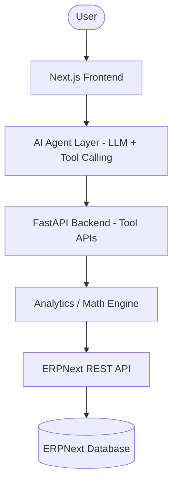

--# Vireon — Your AI Financial Copilot for ERP Systems

## Overview

**Vireon** is an AI-powered financial intelligence system designed to work alongside enterprise ERP platforms. The system acts as a fractional AI CFO, capable of analyzing financial data, detecting anomalies, forecasting cash runway, and answering complex financial questions in natural language.

Instead of building a simulated financial database from scratch, this system integrates directly with **ERPNext**, an open-source enterprise resource planning system used by real companies for accounting, financial management, and operations.

### ERPNext Data Coverage & Positioning
Vireon acts as an AI Copilot that **works with ERPNext + has its own modules for what's missing**. Core metrics (cash, burn, runway, revenue, expenses, and GL anomalies) are derived directly from ERPNext data. However, specific gaps in standard ERPNext are handled natively by Vireon's own tables, including:
- **Payroll/HR data** (`Employee` and `PayrollEntry` tables)
- **Loans and custom depreciation** (`Loan` and `FixedAsset` tables)

The AI agent operates as a financial analyst and decision-support tool. It retrieves financial data from ERPNext, processes it using a deterministic analytics engine, and communicates insights through a conversational interface and interactive dashboards.

This architecture ensures that financial calculations remain deterministic and auditable while still enabling natural language interaction through a large language model.

## System Architecture

The project moves from a demo financial simulator to a real enterprise workflow system, where ERPNext serves as the **financial system of record**.



### Core System Components

1.  **Frontend (Next.js + Tremor)**: Interactive dashboards, cash runway visualization, AI chat interface, and scenario simulation.
2.  **AI Agent Layer (GPT-4o)**: Interprets user questions and orchestrates tool usage. The agent **never** performs calculations; it calls backend tools.
3.  **Backend API Layer (FastAPI)**: Acts as the tool layer, querying ERPNext and providing structured financial outputs.
4.  **Math Engine (Python)**: Deterministic functions for calculating startup metrics (Burn Rate, Runway, ARR, MRR, Gross Margin).
5.  **ERPNext Integration**: ERPNext stores all data (Sales Invoices, Purchase Invoices, Payment Entries, GL Entries) as the source of truth.

## Tech Stack Summary

| Layer           | Technology                    |
| :-------------- | :---------------------------- |
| **Frontend**    | Next.js, Tailwind CSS, Tremor |
| **AI Agent**    | OpenAI GPT-4o / LangGraph     |
| **Backend**     | Python, FastAPI               |
| **Math Engine** | Python (Deterministic Logic)  |
| **ERP System**  | ERPNext                       |
| **Database**    | MariaDB (ERPNext default)     |

## Key Features

- **Autonomous Financial Alerts**: Monitors ERPNext for spending spikes, customer churn, or runway thresholds.
- **Natural Language Financial Queries**: Ask "Why did expenses increase last month?" and get drivers identified from GL entries.
- **Scenario Simulation**: "What if we hire 3 engineers?" — simulate payroll increases and calculate impact on runway.
- **Financial Forecasting**: Deterministic models for ARR, MRR, Gross Margin, and operating cash flow.

## Current Limitations

While Vireon provides robust financial intelligence, here are some areas that are still in development:

- **Multi-currency support** (partially implemented: currency capture and INR normalization exist; live FX sync, revaluation workflows, and full UI controls are still in progress)
- **Advanced ML forecasting** (implemented with SARIMA and Prophet fallbacks; next step is model monitoring and automated retraining)
- **OCR/document ingestion** (backend upload/status pipeline exists; production-grade OCR extraction and workflow automation are still in progress)

## Implementation Phases

### Phase 1: ERPNext Setup

- Install ERPNext and configure accounting modules.
- Enable REST API access and generate keys.

### Phase 2: Math Engine (Current Focus)

- Implement strict Python functions for core metrics:
  - `Calculate Runway (Cash ÷ Burn Rate)`
  - `Calculate Monthly Burn`
  - `Scenario Modifiers (e.g., Hiring Simulation)`

### Phase 3: Backend API Wrapper

- Implement FastAPI endpoints that wrap ERPNext API calls.
- Examples: `get_cash_balance`, `get_expenses`, `get_revenue`.

### Phase 4: AI Agent Integration

- Implement LLM with tool calling to orchestrate backend tools.

### Phase 5: Dashboard

- Build Next.js UI for visualization and real-time interaction.

## Project Structure

```text
agentic-cfo/
├── frontend/               # Next.js + Tailwind + Tremor
├── backend/                # FastAPI + Math Engine
│   ├── analytics/          # Core Math Engine logic
│   ├── agent/              # LLM Tool orchestration
│   └── erpnext_client/     # ERPNext REST API client
├── erpnext_integration/    # Data import scripts
└── data_generator/         # Financial simulator for populating ERPNext
```

## Future Vision

The long-term goal is to build an AI financial copilot capable of understanding and analyzing enterprise financial systems in real time, enabling founders and operators to make better financial decisions faster. This represents a step toward **autonomous financial intelligence** for modern companies, with Vireon leading the way.

---

## API Reference

All API endpoints are prefixed with `/api/v1/`. Below is a summary of available endpoints:

### Authentication
| Endpoint | Method | Description |
| :-------- | :----- | :---------- |
| `/api/v1/auth/login` | POST | User login |
| `/api/v1/auth/logout` | POST | User logout |
| `/api/v1/auth/register` | POST | Register new user |

### Data Ingestion
| Endpoint | Method | Description |
| :-------- | :----- | :---------- |
| `/api/v1/ingest/accounts` | GET/POST | Fetch and sync accounts |
| `/api/v1/ingest/contacts` | GET/POST | Fetch and sync contacts |
| `/api/v1/ingest/invoices` | GET/POST | Fetch and sync invoices |
| `/api/v1/ingest/expenses` | GET/POST | Fetch and sync expenses |
| `/api/v1/ingest/employees` | GET/POST | Fetch and sync employees |

### Analytics
| Endpoint | Method | Description |
| :-------- | :----- | :---------- |
| `/api/v1/analytics/runway` | GET | Calculate cash runway |
| `/api/v1/analytics/burn-rate` | GET | Calculate burn rate |
| `/api/v1/analytics/metrics` | GET | Get monthly metrics |
| `/api/v1/analytics/summary` | GET | Financial summary |

### AI Agent
| Endpoint | Method | Description |
| :-------- | :----- | :---------- |
| `/api/v1/agent/chat` | POST | Chat with AI agent |
| `/api/v1/agent/tools` | GET | List available tools |

### ERPNext Integration
| Endpoint | Method | Description |
| :-------- | :----- | :---------- |
| `/api/v1/erpnext/sync` | POST | Sync data from ERPNext |
| `/api/v1/erpnext/accounts` | GET | Get accounts |
| `/api/v1/erpnext/invoices` | GET | Get invoices |
| `/api/v1/erpnext/payments` | GET | Get payments |

### Alerts & Anomalies
| Endpoint | Method | Description |
| :-------- | :----- | :---------- |
| `/api/v1/alerts` | GET | List alerts |
| `/api/v1/alerts/{id}` | GET/PUT | Get or update alert |

### Benchmarks
| Endpoint | Method | Description |
| :-------- | :----- | :---------- |
| `/api/v1/benchmarks` | GET | Get industry benchmarks |
| `/api/v1/benchmarks/compare` | POST | Compare against benchmarks |

### Planning & Forecasting
| Endpoint | Method | Description |
| :-------- | :----- | :---------- |
| `/api/v1/planning/budgets` | GET/POST | Manage budgets |
| `/api/v1/planning/forecast` | GET/POST | Manage forecasts |
| `/api/v1/planning/scenarios` | GET/POST | Scenario planning |

### API Documentation

Interactive API documentation is available at:
- **Swagger UI**: `/api/v1/docs`
- **ReDoc**: `/api/v1/redoc`
- **OpenAPI Schema**: `/api/v1/openapi.json`

---

## Environment Variables

| Variable | Default | Description |
| :-------- | :------- | :---------- |
| `DATABASE_URL` | - | PostgreSQL connection string |
| `REDIS_URL` | `redis://localhost:6379/0` | Redis connection string |
| `SECRET_KEY` | `vireon-secret-key-change-in-production` | JWT secret key |
| `GROQ_API_KEY` | - | Groq API key for LLM |
| `USE_LOCAL_LLM` | `false` | Use local Ollama instead of Groq |
| `OLLAMA_BASE_URL` | `http://localhost:11434` | Ollama server URL |
| `SANDBOX_MODE` | `false` | Enable sandbox mode for testing |
| `COMPANY_NAME` | `SeedlingLabs` | Company name for display |

### Sandbox Mode

Set `SANDBOX_MODE=true` in your environment to enable sandbox mode for testing:

```bash
export SANDBOX_MODE=true
```
